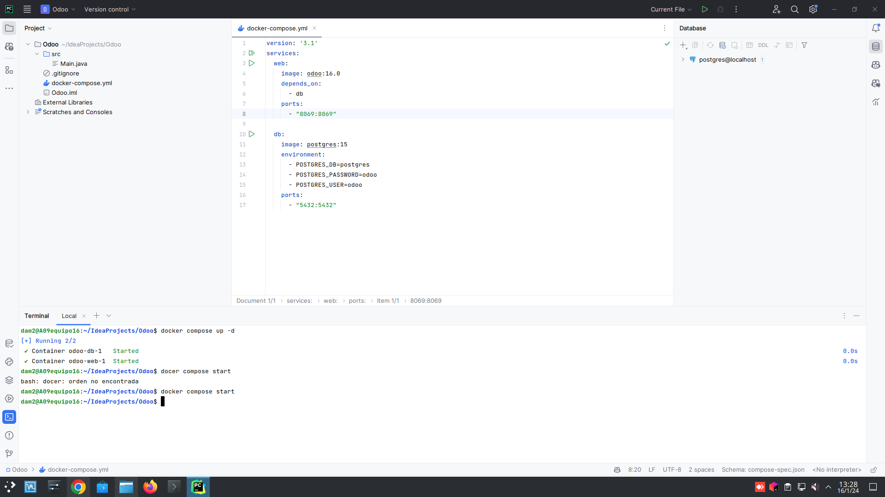
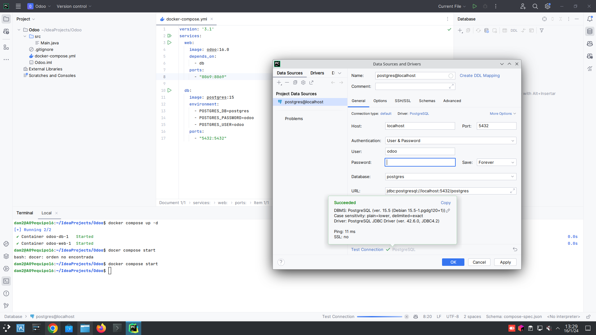
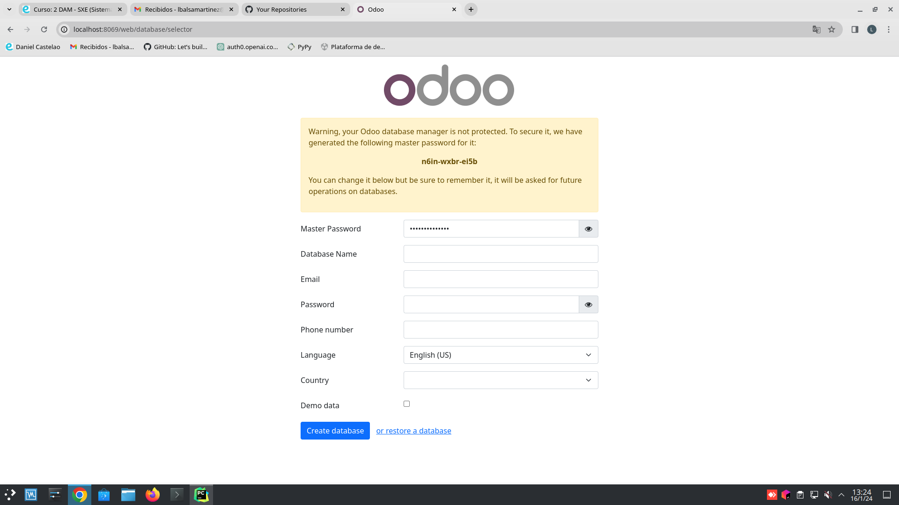
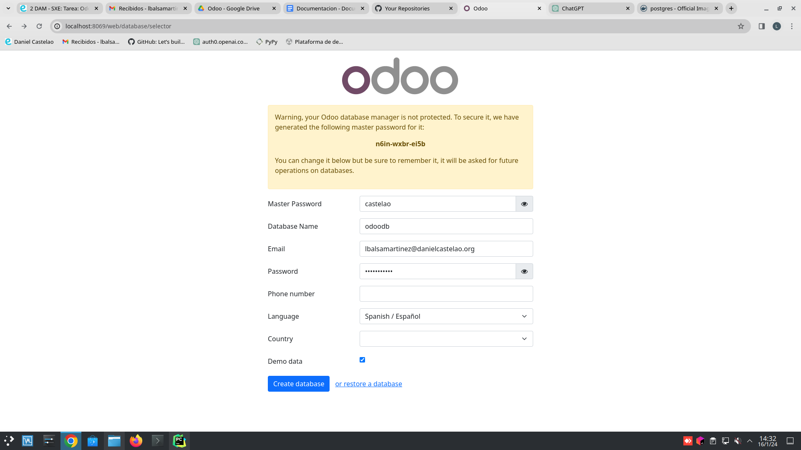
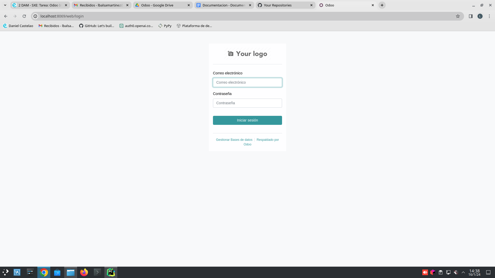
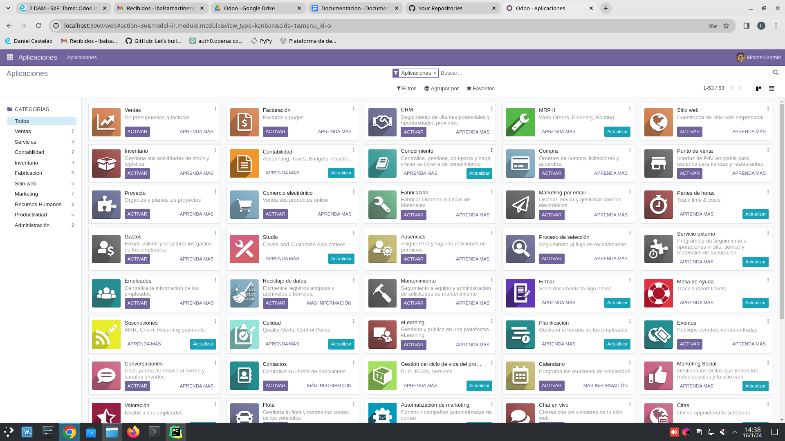

# INSTALACIÓN ODOO #

--------------------

**1. Configuramos el docker-compose.yml**

En la página de [Docker Hub](https://hub.docker.com/_/odoo/) encontramos el docker-compose.yml, correspondiente a la imagen de Odoo.
El archivo sería:
```
version: '3.1'
services:
  web:
    image: odoo:16.0
    depends_on:
      - db
    ports:
      - "8069:8069"
   db:
    image: postgres:15
    environment:
      - POSTGRES_DB=postgres
      - POSTGRES_PASSWORD=odoo
      - POSTGRES_USER=odoo
    ports:
      - "5432:5432"
```

Podemos analizar línea por línea lo que significa el código:

- `version: '3.1'`: Indica la versión de Docker Compose que se está utilizando.
- ```
  services:
  web:
    image: odoo:16.0
    depends_on:
      - db
    ports:
      - "8069:8069"
  ```
  - *services*: Define los servicios de la aplicación.
  - *web*: Nombre del servicio.
  - *image: odoo:16:0*: Especifica la imagen de Docker que se utilizará para el servicio.
  - *depends_on: -db*: Indica que el servicio depende de otro servicio, en este caso, el servicio web depende del servicio db.
  - *ports: -"8069:8069"*: Mapea el puerto 8069 del contenedor al puerto 8069 del host. Esto permite acceder al servicio "web" desde el host a través del puerto 8069.

- ```
   db:
    image: postgres:15
    environment:
      - POSTGRES_DB=postgres
      - POSTGRES_PASSWORD=odoo
      - POSTGRES_USER=odoo
    ports:
      - "5432:5432"
    ```

    - *db*: Se define otro servicio llamado "db".
    - *image: postgres:15*: Se indica la imagen de Docker que se utilizará para este servicio, en este caso, de Postgres.
    - *environment*: Se definen las variables de entorno para la base de datos PostgreSQL. Primero establece el nombre de la base de datos (`POSTGRES_DB=postgres`),
  después establece la contraseña de la BD (`POSTGRES_PASSWORD=odoo`), y
  por último, establece el nombre de usuario de la BD (`POSTGRES_USER=odoo`).
    - *ports: -"5432:5432"*: Mapea el puerto 5432 del contenedor al puerto 5432 del host. Esto permite acceder al servicio "db" desde el host a través del puerto 5432.


**2. Ejecutamos el docker-compose.yml**

Una vez configurado el docker-compose.yml, lanzamos el comando `docker compose up -d` para ejecutar el archivo. Seguidamente hacemos un `docker compose start` para iniciar los servicios.


En el caso de que nos diera error debido al puerto, ya que puede estar ocupado, deberíamos cambiar de puerto en el docker-compose.yml, y volver a ejecutar el comando, o bien, parar el servicio que esté utilizando dicho puerto.
Si queremos la primera opción, debemos saber qué servicio está utilizando dicho puerto. Para ello, ejecutamos el comando `sudo netstat -putan | grep 5432`, y nos aparecerá una lista con los servicios que están utilizando los puertos.
Una vez visto el servicio, lo detenemos con el comando `sudo service nombreServicio stop`, y volvemos a ejecutar el docker-compose.yml.

**3. Configuramos la BD**

En el IDE, vamos al símbolo de la pila que se encuentra a mano derecha, y cramos una nueva base de datos.
En este caso, seleccionamos PostgreSQL, y cubrimos los datos que indicamos en el docker-compose.yml.


**4. Configuramos Odoo**

En este momento, ya podemos acceder a Odoo desde el navegador.
Para ello, introducimos la dirección IP `http://localhost:8069`, y nos aparecerá la página de inicio de sesión de Odoo. Primero debemos crear la base de datos.

Cubrimos las credenciales,  y pulsamos sobre el botón "Create database".

Una vez hecho, podemos iniciar sesión y acceder a Odoo.



